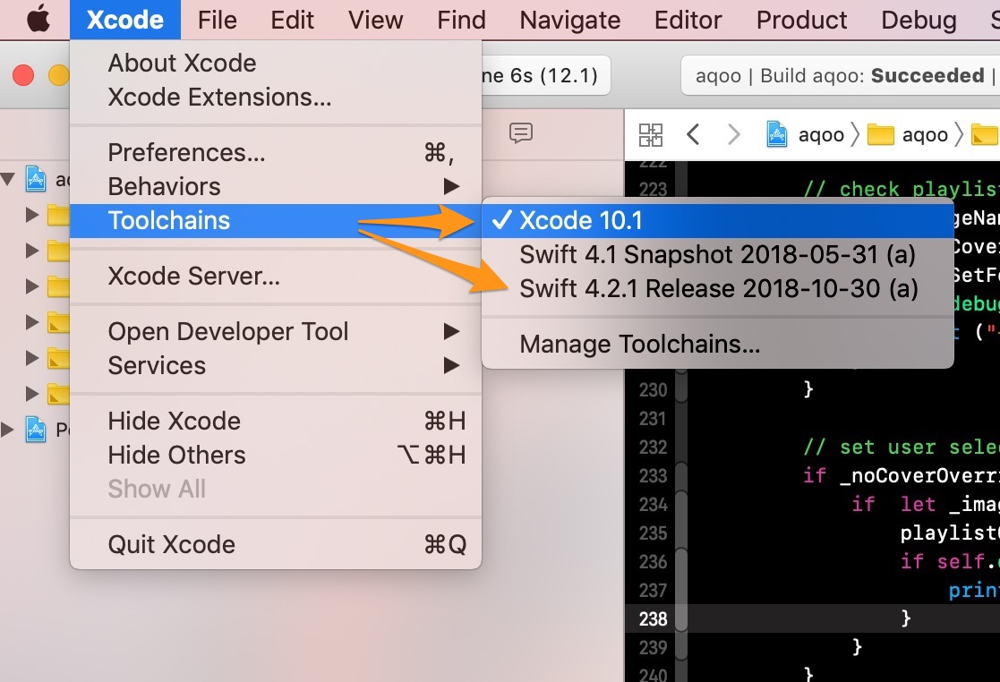
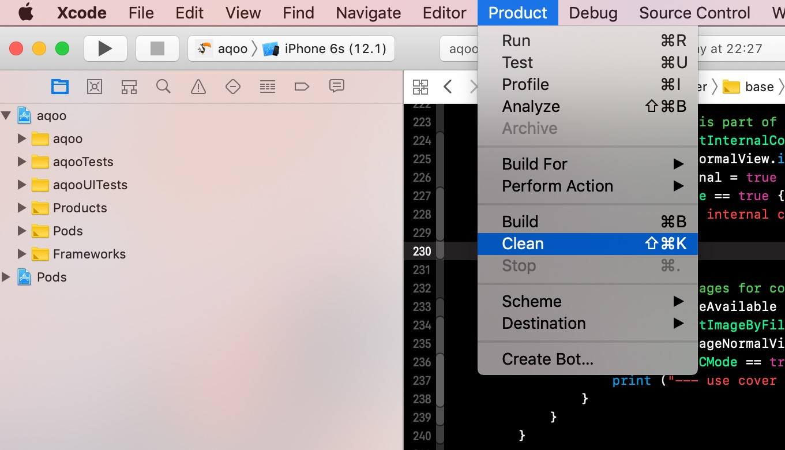
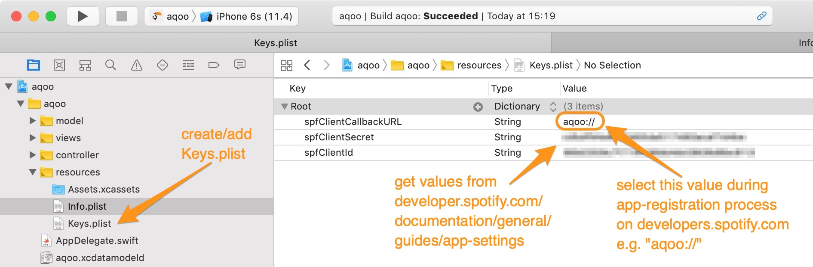

# AQOO
## udacity.com student submission

[](UDACITY)
[](LICENSE)
[](VERSION)
[](https://swift.org)
[](https://itunes.apple.com/us/app/xcode/id497799835?ls=1&mt=12)

*This repository contains the project submission for my udacity.com final project work "AQOO" during my iOS developer certification program (course ND003).*

## App Description

„AQOO“ („A-Q“) is an iOS 11 mobile app that allows users to manage and listen their [spotify](http://spotify.com/) playlists. This app uses the classic 0.27.0 spotify sdk/api iOS framework including some major improvements like dedicated list sorting mechanics, advanced shuffle playmode and advanced rating options.

## App Specifications

- AQOO was developed using the latest XCode 10.1 (10B61) build and is able to run under iOS version 11.4 up to the latest iOS version 12.1 (16B92) 

- AQOO is using POD composition technics to handle 3rd party dependencies. You have to install [POD](https://guides.cocoapods.org/using/getting-started.html) 

- AQOO uses multiple API endpoints of [spotifies iOS SDK](https://developer.spotify.com/documentation/web-api/quick-start/) webAPI-wrapper. An internet connection is required for login, playlist-synch and streaming of your tracks.

- AQOO uses 3rd Party Libraries for better UX/UI behavior and graphical elements from [icons8](https://icons8.de/). A complete list of used libraries and assets can be found in the [COPYRIGHT.md](COPYRIGHT.md) file.

 *more detailed/build related information can be obtained in the ```App Build Process``` section of this documentation*

## App Build Process
To build this app you’ve to take care of the following steps.

1. Checkout this repository on your system 

```
git clone git@github.com:paterik/udacity-ios-aqoo.git --depth 1
```

2. Install [POD](https://guides.cocoapods.org/using/getting-started.html) on your system and load all libs required (do NOT use ```pod install```)

```
cd <your_project_path> ; pod update
```
3. Load project workspace ```aqoo.xcworkspace``` in your XCode 10.1 IDE and ensure your toolchain is set to XCode 10 internal or the currently supported Swift 4.2.1 and may clean up your previous build artifacts using <Product/clean>

ToolChain Setup | Build CleanUp
:-------------------------:|:-------------------------:
  |  

5. Add a new property list (plist) file into your project resource group and insert the 3 required keys (```spfClientSecret```, ```spfClientId```, ```spfClientCallbackURL```) for SpotifyAPI authentication. Generate the corresponding values for this keys from spotifies developer app  [registration formular](https://developer.spotify.com/documentation/general/guides/app-settings/#register-your-app)

 

6. Compile/build the app using one of your favorite device simulators. This app ist optimized for iphone mobile device classes but should also be runnable using bigger screen devices like iPads.

## App Requirements

AQOO needs a valid spotify premium account to authenticate and gain access to your personal playlist information. *Unfortunately spotify free-accounts are currently not supported by this app*.

## App Features

AQOO manages your complete spotify playlist stack and extends some origin meta information by additional functionality and statistics. All playlists and Tracks handled by this app will be stored as dedicated data sets on your mobile device and leave your origin meta source on spotify untouched. You can rename, rate, tag and add detailed notes to your playlists. You also can switch playlist cover images with your own without touching the original dataset at spotify.

AQOO can play your playlists in different modes (normal, repeat and shuffle). You can start playing your lists directly from the corresponding list or from the tracklist view (for normal playmode). The player controls are more sophisticated inside the tracklist view - here you can jump between all tracks or directly in the timeframe of the  current song. In this view all of our playmodes are fully supported.

AQOO helps you filtering your playlist by providing an additional list rating. You can also filter by owner, most-frequently heard or by track count. You can also „hide“ some playlists from your main stack - those playlists will be available again by selecting your „my hidden playlist“ filter option. You can always (re)enable those playlists from that view later.

*For details about application functions and features take a look into our screenshot sections down below*.

## App Structure

AQOO is following the MVC pattern by structural and logical definition. The app is using dedicated view partials instead of base sub views of collection cells and annotations. This app also uses async handlers and event observers to provide better performance during long term execution of internal processes. 

 

## App Start

After starting the app and the launch screen disappears a login view will allow to identify yourself using your spotify credentials. *Please take note that you’ll require a premium spotify account to use AQOO.*

Splash Screen | Login Screen | Spotify Login | Spotify Auth
:-------------------------:|:-------------------------:|:-------------------------:|:-------------------------:
  |   |   |  

##  Your Playlist View

After authentication the app will provide you a tableView with all your spotify playlists available. Here you can filter, edit and hide playlists using background cell controls or open a more detailed cell-view for each entry. *You can also jump from selected playlist into tracklist view directly*.

Playlist View | Playlist Cell Controls | Playlist Cell Details 
:-------------------------:|:-------------------------:|:-------------------------:
 |   | 

## Your Playlist Edit View

You can configure your playlist by editing base information like title and description. Furthermore you can add tags to help categorize your list  and [rate your playlist](https://www.digitalmusicnews.com/2016/05/17/music-genres-three-attributes/) using three different meta values (intensity, emotivness and depth).

Playlist Edit View | Playlist Rating View | Playlist Meta Edit View
:-------------------------:|:-------------------------:|:-------------------------:
 |   | 

## Your Tracklist View

From each playlist entry you can switch to the corresponding tracklist and start playing in shuffle-, repeat- or normal mode. While the track is playing there are additional controls available such as jump between tracks and skipping forward or backward inside the track using the timeframe slider. *In general you can switch between two main views for your playlists stack - the normal table based view and the playlist cover view*. 

Tracklist View | Tracklist Playback | Playlist Cover View
:-------------------------:|:-------------------------:|:-------------------------:
 |   | 

## Known Issues

* The cover image cache for the playlists may take a bit time to display the identified images in our table cells - after view refresh process (by scrolling in your playlist items or leaving this view and returning) all covers should be visible.
* The build process could break if you’re not using the latest XCode 10.1 version and the corresponding Swift binary set in version 4.2.1 - please ensure, that you’re using the right ToolChain and XCode version for this project.
* The application will show ```client_id missing``` error if your Keys.plist file hasn’t complete or invalid value sets - please ensure, that you provide all neccessary values to your Keys.plist file. You’ve to request a valid ```client_id```and ```client_secret``` including your application ```callback_url``` from [spotify/developer](https://developer.spotify.com/documentation/general/guides/app-settings/#register-your-app) app registration page. 

## Keywords

ios, iphone, swift, swift-4, udacity, uikit, foundation, app, spotify, spotify-sdk, streaming, music, player, streams

## Releases

AQQO is currently available in [6 releases](https://github.com/paterik/udacity-ios-aqoo/releases) core and will be following the sequence-based semantic version pattern _major.minor.patch_. The latest stable version of this app is ```1.0.3``` provided on ```2018-12-12```.

## Changelog

All notable changes of the AQOO release series are documented in project [CHANGELOG.md](CHANGELOG.md) file using the [Keep a CHANGELOG](http://keepachangelog.com/) principles. The changelog documentation starts with version 0.0.1 (2017-07-18).

## License-Term

Copyright (c) 2017-2018 Patrick Paechnatz <patrick.paechnatz@gmail.com>
                                                                           
Permission is hereby granted,  free of charge,  to any  person obtaining a copy of this software and associated documentation files (the "Software"), to deal in the Software without restriction,  including without limitation the rights to use,  copy, modify, merge, publish,  distribute, sublicense, and/or sell copies  of the  Software,  and to permit  persons to whom  the Software is furnished to do so, subject to the following conditions:       
                                                                           
The above copyright notice and this permission notice shall be included in all copies or substantial portions of the Software.
                                                                           
THE SOFTWARE IS PROVIDED "AS IS", WITHOUT WARRANTY OF ANY KIND, EXPRESS OR IMPLIED, INCLUDING  BUT NOT  LIMITED TO THE WARRANTIES OF MERCHANTABILITY, FITNESS FOR A PARTICULAR  PURPOSE AND  NONINFRINGEMENT.  IN NO EVENT SHALL THE AUTHORS OR COPYRIGHT HOLDERS BE LIABLE FOR ANY CLAIM, DAMAGES OR OTHER LIABILITY,  WHETHER IN AN ACTION OF CONTRACT,  TORT OR OTHERWISE,  ARISING FROM,  OUT OF  OR IN CONNECTION  WITH THE  SOFTWARE  OR THE  USE OR  OTHER DEALINGS IN THE SOFTWARE.
